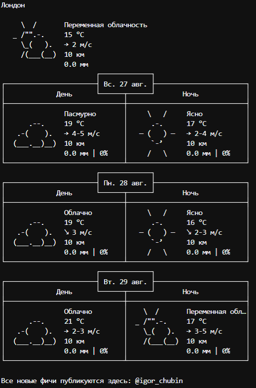

# Получение погоды из терминала
Скрипт позволяет вывести в терминале прогноз погоды в трех локациях: Лондон, аэропорт Шереметьево, Череповец. Прогноз показывается для дня и ночи на текущую дату и на 2 дня вперед. Для получения данных используется сервис [wttr.in](https://wttr.in/).

## Как установить
Скачайте скрипт `show_weather.py`. Установите Python пакеты из `requirements.txt`:
```bash
$ pip install -r requirements.txt
```

## Запустите скрипт в командной строке
```bash
$ python show_weather.py
```
## Пример работы скрипта
Часть вывода с городом Лондон  

